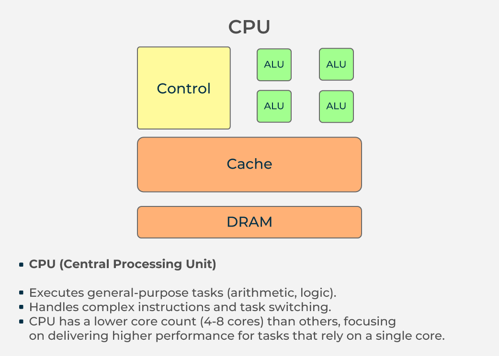
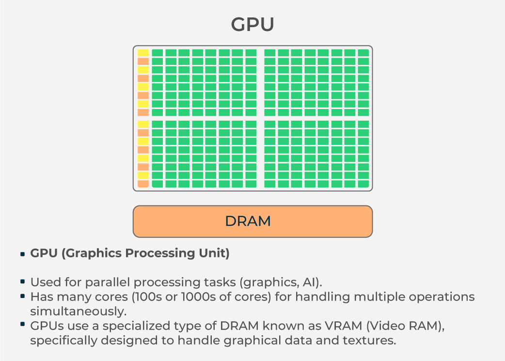

# CPU vs GPU: The Iron Man and Hulk Analogy

In this presentation, we’ll compare **CPU** and **GPU** using **Iron Man** and **Hulk** as analogies.

**Brain:brain: vs Brawn:muscle:**

---

# CPU (Iron Man)

- **Role**: Iron Man represents the **CPU** because he is highly skilled in thinking, strategizing, and making complex decisions.
- **Capabilities**: Iron Man can do many different tasks (like controlling the Iron Man suit, designing technology, etc.), but he does them one at a time.
- **Workload**: The CPU can handle fewer tasks but can perform each one with a lot of variety and precision.

---

# Example: Iron Man's Strategy

- Iron Man thinks deeply and plans one strategy at a time, such as targeting the enemy’s weak spot.
- His strength is in making complex decisions and executing them in sequence.

---

# GPU (Hulk)

- **Role**: Hulk represents the **GPU** because he is fast, powerful, and excels at performing many tasks simultaneously.
- **Capabilities**: Hulk can smash many targets at once, handling parallel tasks efficiently.
- **Workload**: The GPU handles lots of simple tasks in parallel, ideal for operations like graphics rendering and large data processing.

---

# Example: Hulk’s Power

- Hulk can smash many enemies at once without needing to think deeply about each one.
- His strength is in handling multiple repetitive tasks in parallel, like rendering a scene or training a machine learning model.

---


# **CUDA**

Nvidia's brainchild and flagship technology

---

# CPU vs GPU in Action

- **Iron Man (CPU)**: Handles complex tasks like running the operating system, managing logic, and processing varied software.
- **Hulk (GPU)**: Handles tasks that involve large amounts of simple actions simultaneously, like rendering graphics or processing data.

---

# In a Game Example

- **Iron Man (CPU)**: Manages game logic, character AI, and overall physics of the game.
- **Hulk (GPU)**: Renders graphics and processes visual data, ensuring the game looks smooth and fast.

---

# Conclusion

- **Iron Man (CPU)**: Focuses on complex, sequential tasks.
- **Hulk (GPU)**: Focuses on parallel tasks with raw power.
- Together, they make a powerful team for handling diverse computing tasks!

---



---



---

# CPU vs GPU

| **Feature**           | **CPU**                          | **GPU**                                              |
| --------------------- | -------------------------------- | ---------------------------------------------------- |
| **Purpose**           | General-purpose computation      | Specialized computation for graphics, parallel tasks |
| **Task Handling**     | Single-threaded, complex tasks   | Highly parallel tasks (e.g., graphics rendering)     |
| **Optimization**      | Sequential processing            | Parallel processing                                  |
| **Cache Memory**      | Smaller (L1, L2, L3)             | Larger (VRAM) for high-speed data transfer           |
| **Energy Efficiency** | More efficient for general tasks | Higher power consumption for parallel tasks          |

---

# Definition

- CUDA (Compute Unified Device Architecture) is a parallel computing platform and programming model developed by NVIDIA.
- It allows developers to use NVIDIA GPUs (Graphics Processing Units) for general-purpose computing (GPGPU).
- CUDA provides a way to harness the massive parallelism of GPUs to accelerate computations in various fields, including artificial intelligence, scientific simulations, and real-time graphics.

---

# Why CUDA?

1. **High Performance**: Leverages thousands of GPU cores for parallel processing.
2. **Ease of Use**: Extends C/C++ with simple keywords and APIs.
3. **Massive Parallelism**: Executes many tasks simultaneously.
4. **Optimized Libraries**: Offers libraries like cuBLAS (linear algebra), cuDNN (deep learning), and Thrust (high-level algorithms).

---

# CUDA Programming Model

- Host (CPU): Executes the main program.
- Device (GPU): Executes parallel computations.
- Kernels: Functions executed on the GPU in parallel.
- Threads & Blocks: CUDA organizes parallel execution in a grid of blocks, and each block contains multiple threads.

---

# Example Code without CUDA

```c
#include <iostream>
#include <vector>
const int N = 1000000; // Size of the arrays
// Function to add two arrays
void add(const std::vector<int>& a, const std::vector<int>& b, std::vector<int>& c) {
    for (int i = 0; i < N; i++) {
        c[i] = a[i] + b[i];
    }
}
int main() {
    std::vector<int> a(N), b(N), c(N);
    // Initialize arrays
    for (int i = 0; i < N; i++) {
        a[i] = i;
        b[i] = i * 2;
    }
    // Perform addition
    add(a, b, c);
    // Print a few results
    for (int i = 0; i < c.size(); i++) {
        std::cout << "c[" << i << "] = " << c[i] << std::endl;
    }
    return 0;
}
```

---

# Explanation of the Code

- Declare Arrays: Create three arrays a, b, and c of size N.
- Initialize Arrays:
  - `a[i] = i`
  - `b[i] = i \* 2`
- Call add Function: Pass arrays a, b, and c to the add function.
- In add Function:
  - Loop from `0 to N-1`
  - Add `a[i]` and `b[i]` and store the result in `c[i]`.
- Print Results: Display the first 10 elements of c.
- End Program: Program finishes execution.

---

# Example Code using CUDA

```c
#include <iostream>
#include <cuda_runtime.h>
const int N = 1024; // Size of the arrays
// CUDA kernel function to add two arrays
__global__ void add(int *a, int *b, int *c) {
    int idx = threadIdx.x + blockIdx.x * blockDim.x;
    if (idx < N) {
        c[idx] = a[idx] + b[idx];
    }
}
int main() {
    int *a, *b, *c;  // Host pointers
    int *d_a, *d_b, *d_c;  // Device pointers
    size_t size = N * sizeof(int);
    // Allocate host memory
    a = (int*)malloc(size);
    b = (int*)malloc(size);
    c = (int*)malloc(size);
    // Initialize host arrays
    for (int i = 0; i < N; i++) {
        a[i] = i;
        b[i] = i * 2;
    }
    // Allocate device memory
    cudaMalloc(&d_a, size);
    cudaMalloc(&d_b, size);
    cudaMalloc(&d_c, size);
    // Copy data from host to device
    cudaMemcpy(d_a, a, size, cudaMemcpyHostToDevice);
    cudaMemcpy(d_b, b, size, cudaMemcpyHostToDevice);
    // Launch the kernel with one block of 256 threads
    add<<<(N + 255) / 256, 256>>>(d_a, d_b, d_c);
    // Copy result from device to host
    cudaMemcpy(c, d_c, size, cudaMemcpyDeviceToHost);
    // Print a few results
    for (int i = 0; i < 10; i++) {
        std::cout << "c[" << i << "] = " << c[i] << std::endl;
    }
    // Free device memory
    cudaFree(d_a);
    cudaFree(d_b);
    cudaFree(d_c);
    // Free host memory
    free(a);
    free(b);
    free(c);
    return 0;
}
```

---

# Explanation

- The add kernel function adds elements from two arrays (a and b) and stores the result in array c.
- We allocate memory for the arrays both on the host (CPU) and the device (GPU).
- The kernel is launched with one block of 256 threads to handle the addition.
- After execution, the result is copied back to the host for printing.

---

1. **CPU Version (Without CUDA)**: Uses standard C++ with `<chrono>` and `<sys/resource.h>` to measure execution time and resource usage.
2. **CUDA Version (With CUDA Acceleration)**: Uses NVIDIA CUDA to parallelize the addition operation and measures GPU execution time.

Both programs perform the same operation: adding two large arrays element-wise.

---

## **1. CPU Version (Without CUDA)**

```cpp
#include <iostream>
#include <vector>
#include <chrono>
#include <sys/resource.h>

const int N = 1000000; // Size of the arrays

// Function to add two arrays on CPU
void add_cpu(const std::vector<int>& a, const std::vector<int>& b, std::vector<int>& c) {
    for (int i = 0; i < N; i++) {
        c[i] = a[i] + b[i];
    }
}

// Function to print resource usage
void print_resource_usage() {
    struct rusage usage;
    if (getrusage(RUSAGE_SELF, &usage) == 0) {
        std::cout << "User CPU time used: " << usage.ru_utime.tv_sec + usage.ru_utime.tv_usec / 1e6 << " seconds\n";
        std::cout << "System CPU time used: " << usage.ru_stime.tv_sec + usage.ru_stime.tv_usec / 1e6 << " seconds\n";
        std::cout << "Maximum resident set size: " << usage.ru_maxrss << " KB\n";
    } else {
        std::cerr << "Failed to get resource usage.\n";
    }
}

int main() {
    std::vector<int> a(N), b(N), c(N);

    // Initialize arrays
    for (int i = 0; i < N; i++) {
        a[i] = i;
        b[i] = i * 2;
    }

    // Measure time
    auto start = std::chrono::high_resolution_clock::now();
    add_cpu(a, b, c);
    auto end = std::chrono::high_resolution_clock::now();
    std::chrono::duration<double> duration = end - start;

    // Print results
    std::cout << "CPU Time taken for addition: " << duration.count() << " seconds\n";
    print_resource_usage();

    return 0;
}
```

---

## **2. CUDA Version (With CUDA Acceleration)**

```cpp
#include <iostream>
#include <cuda_runtime.h>
#include <chrono>

const int N = 1000000; // Size of the arrays

// CUDA Kernel to add two arrays
__global__ void add_cuda(const int* a, const int* b, int* c, int size) {
    int i = blockIdx.x * blockDim.x + threadIdx.x;
    if (i < size) {
        c[i] = a[i] + b[i];
    }
}

int main() {
    int *h_a, *h_b, *h_c; // Host arrays
    int *d_a, *d_b, *d_c; // Device arrays

    size_t bytes = N * sizeof(int);

    // Allocate memory on host
    h_a = (int*)malloc(bytes);
    h_b = (int*)malloc(bytes);
    h_c = (int*)malloc(bytes);

    // Initialize arrays
    for (int i = 0; i < N; i++) {
        h_a[i] = i;
        h_b[i] = i * 2;
    }

    // Allocate memory on GPU
    cudaMalloc((void**)&d_a, bytes);
    cudaMalloc((void**)&d_b, bytes);
    cudaMalloc((void**)&d_c, bytes);

    // Copy data from host to device
    cudaMemcpy(d_a, h_a, bytes, cudaMemcpyHostToDevice);
    cudaMemcpy(d_b, h_b, bytes, cudaMemcpyHostToDevice);

    // Launch kernel
    int blockSize = 256;
    int gridSize = (N + blockSize - 1) / blockSize;

    auto start = std::chrono::high_resolution_clock::now();
    add_cuda<<<gridSize, blockSize>>>(d_a, d_b, d_c, N);
    cudaDeviceSynchronize();
    auto end = std::chrono::high_resolution_clock::now();

    // Copy result back to host
    cudaMemcpy(h_c, d_c, bytes, cudaMemcpyDeviceToHost);

    // Compute duration
    std::chrono::duration<double> duration = end - start;
    std::cout << "CUDA Time taken for addition: " << duration.count() << " seconds\n";

    // Free memory
    cudaFree(d_a);
    cudaFree(d_b);
    cudaFree(d_c);
    free(h_a);
    free(h_b);
    free(h_c);

    return 0;
}
```

---

## **Compilation and Execution**

### **For CPU Version**

```bash
g++ -o cpu_addition cpu_addition.cpp -O2
./cpu_addition
```

### **For CUDA Version**

```bash
nvcc -o cuda_addition cuda_addition.cu
./cuda_addition
```

---

## **Performance Expectations**

- **CPU Version**: Runs in a single thread, slower than GPU but still optimized.
- **CUDA Version**: Uses GPU parallelism, which is significantly faster for large arrays.

---

## **Conclusion**

- The CUDA version should be **faster** due to GPU parallelism.
- The CPU version is easier to use and doesn’t require a dedicated GPU.
- CUDA requires data transfers between CPU and GPU, which can add overhead.
